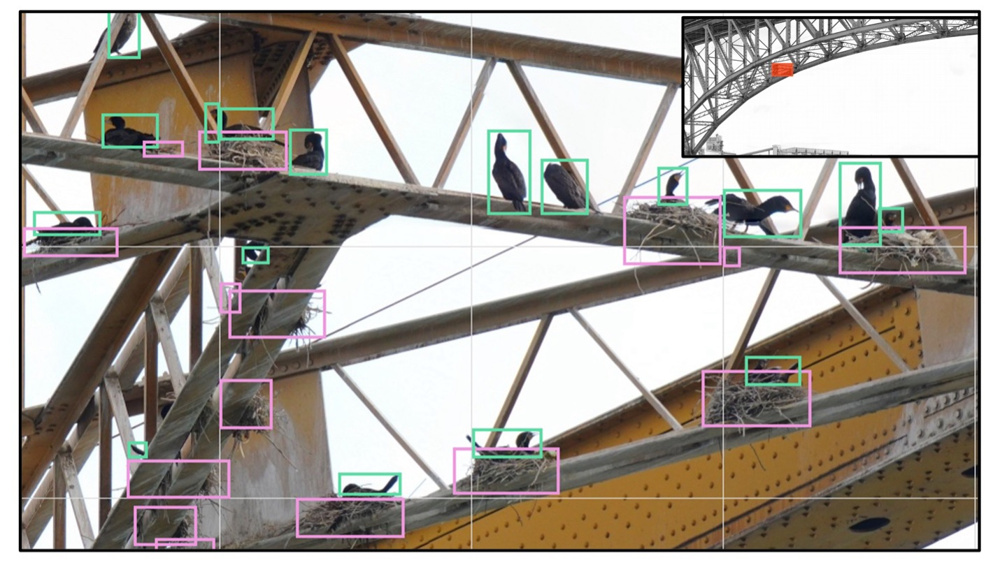
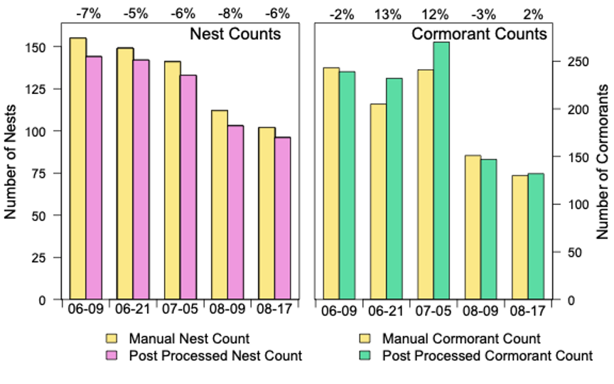
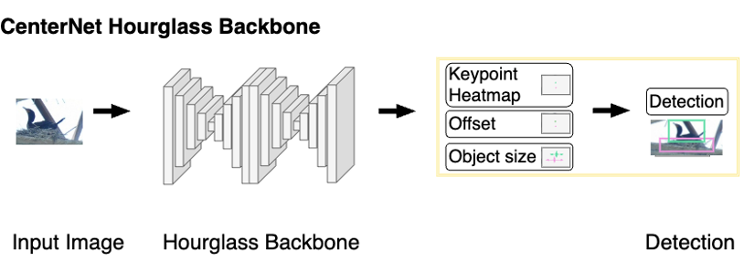

# cormorants-nesting-scripts
This repository contains all the Python code relevant for the Cormorants BC Nesting project. 

This study captures the breeding cycle of Double-crested Cormorants (DCCOs) in 2021 on the Ironworkers Memorial Second Narrows (IMSN) Bridge in Vancouver, British Columbia. Cormorants and their nests on the bridge were counted from April 4th to September 24th, 2021, to align with the DCCO nesting season (Chatwin et al. 2002). We consistently visited the same permanent sampling location (North Shore vantage point) at a 100-150 m distance from the bridge (49.298, -123.025) to capture one orthomosaic image of the DCCO breeding colony on the 2nd span (span 2) of the IMSN bridge (Figure 1). 

> [**Vantage point orthomosaics and deep learning methods save time in monitoring seabird nesting colonies**](http://),            
> Rosie Wilkin, ..., Ruth Joy        
> *Submitted to Ornithological Applications ([Ms. No. ORNITH-APP-24-071R1](http://))*   

Contact: Corresponding Author @RoseWilkin. Any questions or discussions are welcomed! 

## Abstract 

Monitoring seabird colonies is essential for assessing population health and sustainability in the context of growing anthropogenic activities. Advancements in photography over the last century have led to high-resolution photogrammetry techniques for monitoring seabird colonies. However, manual counting of birds and nests in large images, potentially over multiple dates and multiple seasons is time-consuming and has limited a wider adoption of photogrammetry in colony monitoring. We addressed the task of automatically counting cormorants and their nests using an SLT camera, a Gigapan robotic camera mount and image-stitching software. We applied this system to Vancouver’s Ironworkers Memorial Second Narrows Bridge, home to British Columbia’s largest Double-crested Cormorant colony. The system takes overlapping images of the colony from a single vantage point to create a panoramic (orthomosaic) image. We took weekly images of the bridge totalling 23 panoramic images between April and September 2021. We built an automated counting [pipeline](#pipeline-and-model-details) by training an object detection model using a deep-learning convolutional neural network (CNN) architecture. We trained a [Centernet Hourglass CNN model](#pipeline-and-model-details) to detect cormorants of different sizes, positions (standing, incubating, sunning with wings outstretched) and nests (including only partial glimpses amongst the bridge girders). This increased count accuracy and saved labor-intensive image processing tasks by 96%. The automated counting pipeline achieved mean Average Precision of 0.82 and 0.91 for cormorants and nests respectively. Average Recall achieved similarly high rates of 0.86 and 0.94 for cormorants and nests. Finally, despite a reduction in performance at a novel study site, the significant decrease in manual effort would compensate for minimal fine-tuning efforts, providing an alternative to manual counts in other contexts. Our study showcases that high-resolution photogrammetry combined with deep learning methods allows for automatic identification and counting of birds and nests, ultimately facilitating the long-term monitoring of Double-crested Cormorants.

## Highlights

- **Simple:** One-sentence method summary: use single shot object detection models to detect cormorants and nests in high resolution images.

- **Fast:** The whole process in a single network feedforward. No NMS post processing is needed. Our DLA-34 model runs at *52* FPS with *37.4* COCO AP.

- **Simple:** One-sentence method summary: use keypoint detection technic to detect the bounding box center point and regress to all other object properties like bounding box size, 3d information, and pose.

**Lay Summary**

- Monitoring seabirds is essential because of their status as indicators for ecosystem health. 
- High-resolution photography is one monitoring method, but can be time-consuming. 
- We addressed the task of automatically counting cormorants and nests using a camera, Gigapan robotic mount, image-stitching software, and a deep-learning object detection model. 
- We applied this system to a bridge that is home to British Columbia’s largest Double-crested Cormorant colony. 
- We trained an object detection model to automate the counting of birds and nests. This reduced human labor time from 225 minutes to 25 minutes.
- Performance was poorer at a novel bridge site, suggesting that the model would require additional training for application to other contexts.. 
- Our study showcases that high-resolution photography combined with deep learning methods can efficiently count Double-crested Cormorants and their nests.

## Main results

The introduction of the automated pipeline did not decrease the field time required to collect an orthomosaic image (Table 2). However, the automated pipeline required a human to annotate a mask for the bridge and configure the job for the (Cedar high-performance) computing cluster. The true advantages of the automated pipeline became evident in the reduced time required for active computer work (decreased by 96% over the manual counting effort). Instead, the automated pipeline is run without human intervention or supervision and takes approximately 15 minutes to generate counts. As this step is unsupervised, this portion of the pipeline is not included in the ‘human labor time’ calculations in Table 2. 

|                           | Time in the field | Active Computer Time | Automated Processing time   | Total Time | Human labor time  |
|---------------------------|-------------------|----------------------|-----------------------------|------------|-------------------|
| Manual Counts             | 15-min            | 240-min              | 0-min                       | 255-min    | 255-min           |
| Automated-Pipeline Counts | 15-min            | 10-min               | 15-min                      | 40-min     | 25-min            |

> TABLE 2. Time and Effort Requirements to count cormorants and nests in a single orthomosaic image of Span 2 at the peak of the nesting season on the IMSN bridge.

## About this repository

The top-level directory contains the following folders: 
1. [`gigapan_data_inventory`](/gigapan_data_inventory) &mdash; Contains a text file detailing what data we have for this project (last updated Feb 10, 2022). This includes reference to which data were used for training, validating, and testing the CNN models. 
2. [`object_detection_scripts`](/object_detection_scripts) &mdash; Contains Python code for the object detection pipeline. Within this directory, you'll find many more subdirectories, each corresponding to a particular task in the pipeline. Each subdirectory is composed of a `input`, `output`, and `src` folder. The structure of these directories is described in more detail within the `object_detection_scripts` [README.md](/object_detection_scripts/README.md). There you will also find instructions for running the Python code (on either your local machine or on a cluster system). 
3. [`docs`](/docs) &mdash; Contains documentation for working with trained models, Cedar, and the commandline generally.

## Pipeline and Model details

 Bridge cormorant colony, and building an artificial convolutional neural net (CNN) model for cormorant and nest detection. The workflow began with pre-processing an orthomosaic as input into smaller tiles, each tile with 1000x1000 pixels. We then draw bounding boxes around cormorants and nests as annotations (Annotation Pipeline). The CNN model learned from the provided annotation examples (Training Pipeline) to draw bounding boxes on new unseen orthomosaic images (Prediction Pipeline). Post-processing corrects for double-counting the same nest captured on adjacent tiles and for identifying objects outside our area of interest. The remaining bounding boxes of cormorants and nests were summed to produce counts (Final Output) of the IMSN bridge.")

The <cite>TensorFlow Object Detection API (Yu et al., 2020)[^1]</cite> was used to train our deep learning model. The Tensorflow Object Detection API provides model architectures pre-trained on the 2017 version of the <cite>Microsoft COCO: Common Objects in Context dataset (Lin et al., 2014)[^2]</cite>, a library of annotated images containing over 200,000 labelled images and 80 object categories. Using benchmarked mean precision and inference speed on the Microsoft COCO dataset, we selected 4 pre-designed architectures to train to detect cormorants and nests in our annotated dataset: (1) CenterNet Hourglass104 512x512 (CenterNet Hourglass), (2) CenterNet Resnet101 V1 FPN 512x512, (3) ResNet50 V1 FPN 1024x1024 also called RetinaNet50, and (4) EfficientDet D0 512x512 model.

Using benchmarked mean precision and inference speed on the <cite>[Microsoft COCO dataset][^2]</cite>, we selected 4 pre-designed architectures to train to detect cormorants and nests in our annotated dataset: (1) CenterNet Hourglass104 512x512 (CenterNet Hourglass), (2) CenterNet Resnet101 V1 FPN 512x512, (3) ResNet50 V1 FPN 1024x1024 also called RetinaNet50, and (4) EfficientDet D0 512x512 model.

We evaluated each trained architecture on a validation dataset using the standard mAPIoU=0.5 and ARmax=10 metrics (Zou et al., 2023; Padilla et al., 2021). The CenterNet Hourglass (supplemental material, Figure 1) performed best and was integrated into the automated pipeline.

For census counts, detecting an object is more important than precise localization, i.e., detecting is more important than its exact location and shape. Localization errors occur when a model detects but incorrectly places an object, yielding an IoU between 0.1 and 0.5 (Hoiem, et al., 2012). While we consider such detections successful, the standard mAPIoU=0.5 metric classifies these detections as false positive errors and their associated annotations as false negatives, thereby artificially reducing precision and recall. To avoid conflation of detection and localization performance, we used mAPIoU=0.1 to assess the impact of each post-processing step in addition to the overall automated pipeline’s performance.

Additionally, we used ARmax=400 to evaluate the overall automated pipeline’s ability to detect objects in full panoramas. Given panoramas may contain hundreds of objects (cormorants and nests), standard variations of AR (ARmax=1, 10, 100) would not suffice. Instead, a detection limit of 400 allowed theoretical detection of all objects while continuing to remove low-scoring detections from consideration. 

The final automated pipeline obtained a mAPIoU=0.1 of 0.82 on cormorants and 0.91 on nests. When examining spatial distribution of mAPIoU=0.1, we found no correlation between precision and distance from vantage point. Further, it achieved an ARmax=400 of 0.86 for cormorants and 0.94 for nests. The detection threshold that optimizing the Precision-Recall (PR) curves for F1-scores 0.89 (nest) and 0.80 (cormorants) at thresholds of 0.20 for nests and 0.21 for cormorants.

<!-- Figure 5 provides additional detail on the pipeline’s performance by presenting precision-recall curves for both cormorants and nests, noting the highest F1 score for cormorants was 0.80, and for nests was 0.89.  -->

The detection threshold at 0.20 for nests and 0.21 for cormorants optimizes the Precision-Recall (PR) curves with F1-scores 0.89 (nest) and 0.80 (cormorants).

| Model + Masking + Merging Duplicate Nests | Cormorants | Nests  | Overall  |
|-------------------------------------------|------------|--------|----------|
| mAPIoU=0.1                                | 0.82       | 0.91   | 0.87     |
| ARmax=400                                 | 0.86       | 0.94   |          |
| F1                                        | 0.80       | 0.89   |          |
| F1 detection threshold                    | 0.21       | 0.20   |          |

> TABLE 1. The automated pipeline’s performance on 2020 data improves with each post-processing step. Class-specific mAPIoU=0.1 compares pipeline detections with expert annotations; of the predicted cormorants/nests, how many (%) were annotated by experts? The Overall column is the average of class-specific mAPIoU=0.1 values. 

## References

[^1]: Yu, H., Chen, C., Du, X., Li, Y., Rashwan, A., Hou, L., Jin, P., Yang, F., Liu, F., Kim, J., Li, J. (2020). TensorFlow Model Garden. Retrieved from https://github.com/tensorflow/models

[^2]: Lin, T.-Y., M. Maire, S. Belongie, J. Hays, P. Perona, D. Ramanan, P. Dollár, and C. Lawrence Zitnick (2014). Microsoft COCO: Common objects in context. Computer Vision – ECCV (13th European Conference on Computer Vision) 2014, Zurich, Switzerland, September 6–12, 740–755. URL: http://cocodataset.org/

## License

## Citation

If you find this project useful for your research, please use the following BibTeX entry.

    @misc{
        # TODO
    }

This research was enabled in part by support provided by BC DRI Group and the Digital Research Alliance of Canada (alliance​can​.ca).

The authors acknowledge consultation/support from the staff/[actual names] from the Research Computing Group ([rcg.sfu.ca](https://www.rcg.sfu.ca)), IT Services at Simon Fraser University.

