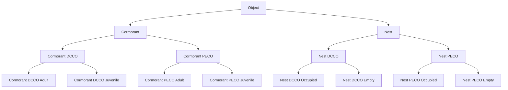

# Combine Annotation Labels

This directory contains the code used for "combining" annotation labels based on
a hierarchical label tree, to achieve a specified level of granularity.

This allows annotators to assign granular labels to objects while recognizing
that a downstream model may not be trained to identify objects at such a
granular level.

For example, our goal was to train a model to identify cormorants or nests.
However, many of our annotators were capable of identifying the species and/or
age of the cormorants they annotated. To ensure this information was not lost,
annotators were asked to assign the most fine-grained labels they were confident
in. However, we used this task to combine all the labels under `Cormorant` (e.g.
`Double-Crested Cormorant`, `Pelagic Cormorant`, and `Cormorant`) into a
single label &mdash; `Cormorant`.

**Table of Contents**

* [Running `combine_annotation_labels.py`](#running-combineannotationlabelspy)
    * [CLI Arguments](#cli-arguments)
    * [Input](#input)
    * [Expected Output](#output)
* [Examples](#examples)

## Running `combine_annotation_labels.py`

### CLI Arguments

`combine_annotation_labels.py` provides a CLI for combining annotations using
Python. When running this file from the command line, you must provide the
following:

* `--anno_file`: The file path to a CSV file containing annotations. For
  information on format requirements see [below](#annotation-file).
* `--label_tree_file`:The file path to a CSV file containing the label tree used
  to create the provided annotations. For information on format requirements see
  [below](#label-tree).
* `--out_path`: The file path to use when saving the updated CSV file containing
  updated annotation labels.
* `--desired_labels`: A list of label names to keep. All descendant labels will
  be re-labelled with the relevant label from the desired_labels list. All
  other labels will be removed from the updated CSV.

### Input Files

#### Annotation File

The `--anno_file` argument requires that you specify the path to a CSV file
containing annotations. This code was written to operate on annotation files
output by the LOST annotation tool. The table below contains a few lines from
an example annotation file.

| img.idx | img.anno_task_id | img.timestamp | img.timestamp_lock | img.state | img.sim_class | img.frame_n | img.video_path | img.img_path       | img.result_id | img.iteration | img.user_id | img.anno_time | img.lbl.idx | img.lbl.name | img.lbl.external_id | img.annotator | img.is_junk | anno.idx | anno.anno_task_id | anno.timestamp | anno.timestamp_lock | anno.state | anno.track_id | anno.dtype | anno.sim_class | anno.iteration | anno.user_id | anno.img_anno_id | anno.annotator | anno.confidence | anno.anno_time | anno.lbl.idx | anno.lbl.name | anno.lbl.external_id | anno.data                                                                                            |
|---------|------------------|---------------|--------------------|-----------|---------------|-------------|----------------|--------------------|---------------|---------------|-------------|---------------|-------------|--------------|---------------------|---------------|-------------|----------|-------------------|----------------|---------------------|------------|---------------|------------|----------------|----------------|--------------|------------------|----------------|-----------------|----------------|--------------|---------------|----------------------|------------------------------------------------------------------------------------------------------|
| 4410    | 42               | 34:15.0       | 33:00.5            | 4         | 1             |             |                | 20220517.2.5.jpg   | 82            | 0             | 1           | 73.864        | []          | []           | []                  | ali           |             | 4407     | 42                | 34:15.0        | 33:00.5             | 4          |               | bbox       | 1              | 0              | 1            | 4410             | ali            |                 | 0              | [58]         | ['Cormorant'] | [""]                 | {"x": 0.8467281460762024, "y": 0.8555985689163208, "w": 0.13829029, "h": 0.08431792}                 |
| 4413    | 42               | 17:06.2       | 16:45.2            | 4         | 1             |             |                | 20220517.13.21.jpg | 82            | 0             | 4           | 20.8943       | []          | []           | []                  | bianca        |             | 4422     | 42                | 17:06.2        | 16:45.2             | 4          |               | bbox       | 1              | 0              | 4            | 4413             | bianca         |                 | 0.7852         | [59]         | ['Nest']      | [""]                 | {"x": 0.9016168569354399, "y": 0.5967086417755234, "w": 0.1948664504909976, "h": 0.1748579975967195} |

Annotation pipeline designers (not annotators) can export this CSV by visiting
the pipeline's dashboard and selecting the "Data Export" step. A dialog box will
appear where you can choose to download the annotation file by clicking on the
filename (default is `annos.csv`). This will save a copy of the annotation CSV
to your computer.

This code could alsobe used with other annotation CSVs, provided the CSV
contains an `anno.lbl.name` column that uses labels contained within the
provided label tree (see [below](#label-tree)).

#### Label Tree

The `--label_tree_file` argument requires that you specify the path to a CSV
file containing the label tree used during annotation. A label tree defines the
set of labels available to an annotator. These are the objects the annotator is
responsible for labeling (e.g. Nest & Cormorant) but won't include object types
irrelevant to the task at hand (e.g. boats or pigeons).

More specifically, a label tree organizes these objects in a tree based on their
hierarchical relationships with one another. At the root of the tree is usually
the most general object label (e.g. Object). As you descend the tree you'll
encounter more specific object classes, which fall within the more general
category(ies) which proceed them on the path from root to the node itself.

For example, our Cormorant 2022 label tree has the following structure:



This structure is represented with the following CSV file:

| idx | name                    | parent_leaf_id | is_root |
|-----|-------------------------|----------------|---------|
| 57  | Object                  |                | TRUE    |
| 58  | Cormorant               | 57             | FALSE   |
| 60  | Cormorant DCCO          | 58             | FALSE   |
| 68  | Cormorant DCCO Adult    | 60             | FALSE   |
| 69  | Cormorant DCCO Juvenile | 60             | FALSE   |
| 61  | Cormorant PECO          | 58             | FALSE   |
| 70  | Cormorant PECO Adult    | 61             | FALSE   |
| 71  | Cormorant PECO Juvenile | 61             | FALSE   |
| 59  | Nest                    | 57             | FALSE   |
| 62  | Nest DCCO               | 59             | FALSE   |
| 64  | Nest DCCO Occupied      | 62             | FALSE   |
| 65  | Nest DCCO Empty         | 62             | FALSE   |
| 63  | Nest PECO               | 59             | FALSE   |
| 66  | Nest PECO Occupied      | 63             | FALSE   |
| 67  | Nest PECO Empty         | 63             | FALSE   |

This CSV file can be exported from the LOST annotation tool by following
[these instructions](https://lost.readthedocs.io/en/latest/developing_pipelines/lost_cli.html?#export-label-tree).

### Output Files

#### Updated Annotation File

This interface saves an updated version of the annotations to a CSV file. This
new version will have the following changes:

* The `anno.lbl.external_id` & `anno.lbl.idx` columns will be dropped, thereby
  removing reference to the original label's identifiers.
* The `anno.lbl.name` column will be updated to either one of the
  `desired_labels` provided in the CLI command or `None`. A `None` label is only
  used in cases where the original label does not fall within any of the desired
  label's subtrees.

## Examples

### Combine Annotations to the Cormorant & Nest Level of Granularity

This will take any annotations with labels that fall under the Cormorant or Nest
subtrees and re-label them as either Cormorant or Nest.

```python
python
combine_anno_labels.py
- -anno_file.. / input / gab2 / gabriola_2_annos.csv
- -label_tree_file.. / input / gab2 / cormorants_labels.csv
- -out_path.. / output / gabriola_2_annos_combined.csv
- -desired_labels
Cormorant
Nest
```
