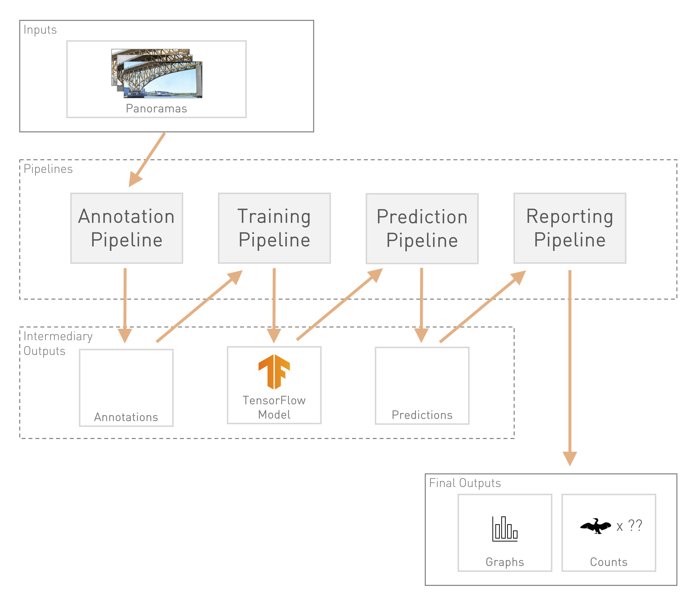

# Object Detection Scripts
This directory contains the Python code used in the object detection pipeline. 
The code has been organized into sub-directories based on the tasks that make up
the pipeline, with each subdirectory corresponding to a single task.

The remainder of this README is organized with the following information: 
* [Task Flow](#task-flow) &mdash; the pipeline and its tasks.
* [Directory Structure](#directory-structure) &mdash; what to expect in each 
  sub-directory.
* [Environment Setup](#environment-setup) &mdash; how to setup your environment
  so you can run the object detection Python code.
* [Running Code](#running-code) &mdash; how to run the code on either your local
  machine or the Cedar compute cluster.

## Task Flow

To Organize:
**Annotation Pipeline**
* `tile_tifs`
* `random_data_selector`
* `model_informed_data_selector`
* LOST annotations (birds & nests)
* `combine_anno_labels`
* `lost_to_tf`

**Training Pipeline**
* `train`
* `export`

**Prediction Pipeline**
* `tile_tifs`
* `resize_image`
* Lost annotations (bridge masks)
* `predict`
* `post_process_detections`

**Reporting Pipeline**
* `compare_counts` (bar charts)
* `draw_final_detections`

## Directory Structure
The object detection code has been organized according to the specific 
task/function that code corresponds to. In other words, each sub-directory is
responsible for a single task in the pipeline (e.g. image tiling, model 
training, post-processing, etc). 

Within each task-specific sub-directory you'll find 3 more sub-directories & one
`README.md` file.: 
* `input` &mdash; this is where the input data (CSVs, images, models, etc) are 
  kept. Often, the input into one task is the output for another. In these cases
  symbolic links can be used to save memories. If you don't see this folder, 
  you'll need to create it. 
* `output` &mdash; this is where the outputs of the task (plots, CSVs, models, 
   etc) are kept. If you don't see this folder, you'll need to create it.
* `src` &mdash; this is where the source code (e.g. Python scripts) is kept. The
  script in this file takes input from the `input` folder and places results in
  the `output` folder.
* `README.md` &mdash; this file details the task and provides instructions for
  running its associated code.

> The organization of directories by task loosely follows David Ball's 
> Principled Data Processing approach to organizing project directories 
> [video](https://www.youtube.com/watch?v=ZSunU9GQdcI).

## Environment Setup
### Local Setup
tldr: Skip to the steps below. 

To run code on your local machine (laptop, desktop, etc), you'll need to install
Python3. The simplest way to do this is by downloading and installing 
[Anaconda](https://www.anaconda.com/). 

> You can think of Anaconda as a pre-filled toolbox for data science work. 
> Instead of buying your toolbox first and slowly filling it with tools, 
> Anaconda provides you with (almost) all the tools you need right off the hop.
> The benefit is that you don't have to spend as much time down the road 
> installing individual tools. The downside is that there are likely going to be
> tools that Anaconda gives you that you will never use, but will nonetheless 
> take up space on your computer.

Here are the steps you need to follow: 
1. Follow the instructions [here](https://docs.anaconda.com/anaconda/install/) 
   to install Anaconda on your machine. Be sure to follow the instructions for
   your OS. You will only need to do this once.
2. Create the `cormorants` environment (the subset of Python packages we will 
   need to run our object-detection scripts). You will only need to do this 
   once. Follow these steps to make this happen: 
   * Open the commandline
   * If you haven't already downloaded or cloned the `cormant-nesting-scripts/` 
     repository from GitHub, follow [these instructions](https://docs.github.com/en/repositories/creating-and-managing-repositories/cloning-a-repository)
     to do so.
   * Use `cd` to navigate to the 
     `cormant-nesting-scripts/object_detection_scripts` directory on your 
     computer.
   * Run `conda env create -f environment.yml` in the commandline to create the
     environment.
3. Activate the environment by running `conda activate cormorants`. You should 
   now see `(cormorants)` at the start of the command line prompt. You will 
   need to do this each time you open up your local commandline to run 
   the object detection scripts.
   
Once you've activated the environment, you'll be able to run code for nearly all
the tasks in the object detection pipeline. The exceptions to this will be tasks
that train or run the TensorFlow model &mdash; `lost_to_tf`, 
`model_informed_data_selector`, `predict`, and `visualize`. To run these tasks 
locally, you will need to install TensorFlow in the environment. The next 
sub-section goes through how to do this.

#### Setting Up Tensorflow
> Note: Model training should not be run locally. It just takes too long. 
> Instead, run training code on Cedar.

### Cedar Cluster Setup

## Running Code
### Locally
1. Activate the `cormorants` conda environment
   `conda activate cormorants`
1. 
1. 
### On Cedar Cluster